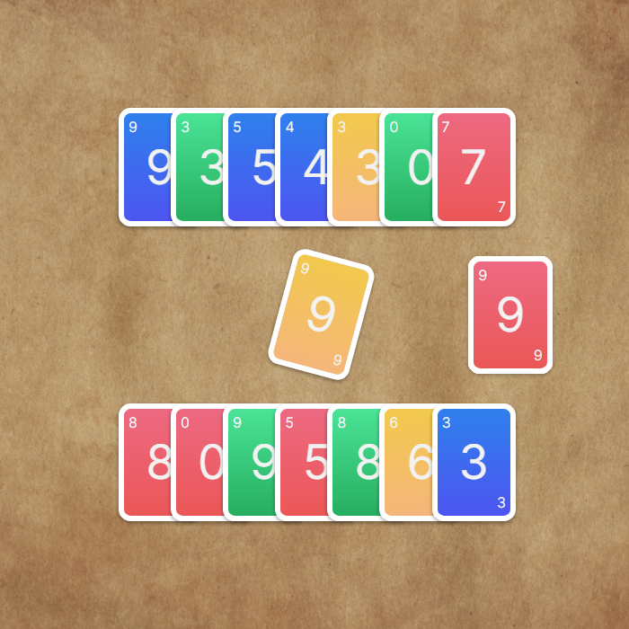

# Uno

Bu proje HTML5, CSS ve JavaScript kullanarak yapilan basit bir UNO kart oyunudur. Oyun tarayıcınızda oynanabilir. Oyunun amacı, elinizdeki kartları bitirmektir. 

# Nasıl Oynanır

Oyun başladığında her oyuncuda 7 kart vardır.

Ortadaki karta göre sıra sizde ise rengi veya numarası aynı olan kartı ortadaki açık olan kartın üstüne koyabilirsiniz.

Elinizde ortadaki kart ile uyuşan bir kart yoksa, kart çekmek için sağ tarafta bulunan desteden sadece 1 tane kart alabilirsiniz.

Eğer alığınız kart ortada bulunan kart ile eşleşmiyorsa sıra otomatik olarak diğer oyuncuya geçer.

Oyunculardan biri elinde kart kalmadan oyunu bitirirse, o oyuncu kazanır.


  
## Bilgisayarınızda Çalıştırın

Projeyi klonlayın

```bash
  git clone https://github.com/remolg/Todolist.git
```

Proje dizinine gidin ve çalıştırın

```bash
  cd "uno"
```

## Ekran Görüntüleri

